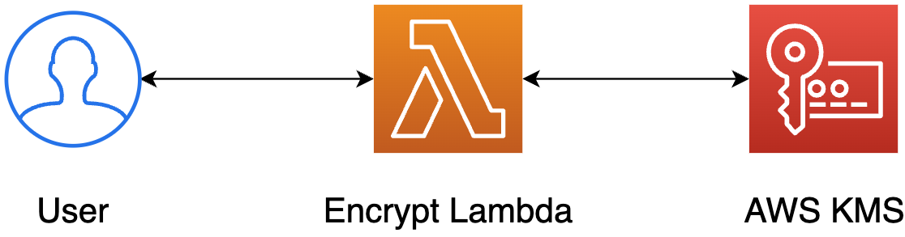
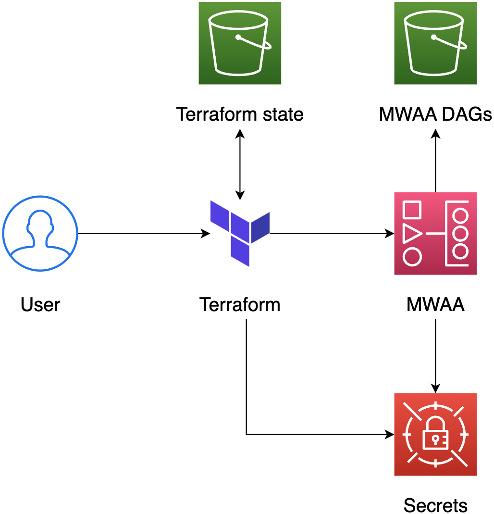
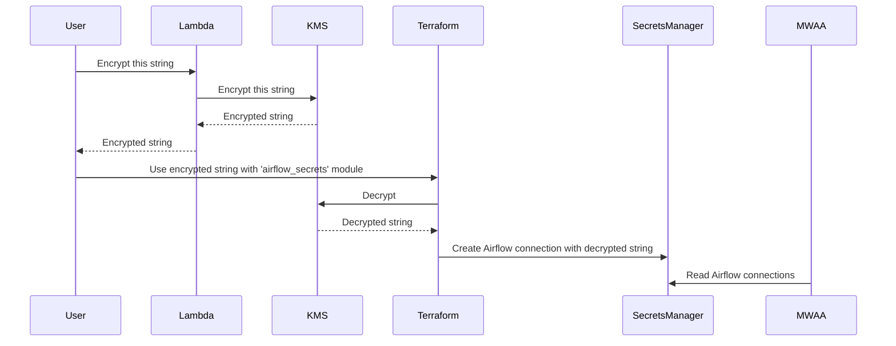

# encrypted-airflow-secrets

This repository contains the source code for a proof-of-concept implementation of how to
manage Airflow secrets through Terraform and keep them committed to a code repository.

More about the solution in the [blog post](https://dev.to/aws-builders/manage-airflow-connections-with-terraform-4hof).

## Architecture diagram

Encrypt the connection string

Use the encrypted connection string to create an Airflow connection 

## Sequence diagram

